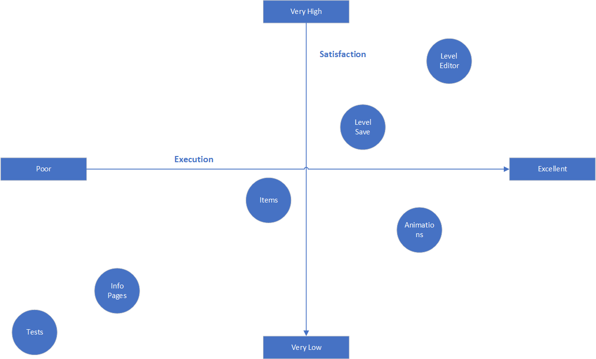

# Daily Scrum 23.10.2017

## Sprint 2
### Review
- Die meisten items im Sprint Backlog konnten bearbeitet werden.
- Multiplayer wurde implementiert von Herrn Peters.  
 Hierzu wurde das projekt in server, game und client aufgeteilt.  
 Der client soll nur benutzereingaben bearbeiten während auf dem server die  
 game instanz läuft und position, kollisionen etc. berechnet.  
 Die Kommunikation zwischen server und client funktioniert über socket.io websockets.
- Die web pages wurden von purem HTML in pug templates umgewandelt um code wiederholug zu vermeiden. 
- Build tools wurden eingeführt um den Entwicklungsprozess zu beschleunigen.  
 Mittels webpack und babel clientseitiges JavaScript vom Aktuellsten ES6 Syntax in für die meisten Browser lesbares JavaScript umgewandelt und kompressiert.  
 CSS wird kompressiert.  
 Der js code wird mit jslint nach code style fehlern geprüft.
- Continuous integregation wurde mit TravisCi implementiert.

### Retrospection
Kommunikation hat sich verbessert.
Jeder war im klaren über seine Aufgaben.
Manche Teammitglieder brauchen etwas mehr motivation bei der Arbeit.  
Das Team einigte sich darauf, denjenigen Teammitgliedern ein reminder Personlich oder auch schrftlich zu übergeben die dies wünschen.

## Sprint 3
### Planning
#### Beschlüsse
- Das Team einigte sich mit dem Product owner darauf, einen prototyp von einem Level Editor zu implementieren (Herr Peters hat sich ). 
- Items zum Aufnehmen sollen implementiert werden.
- Savegames werden weiterhin implementiert (Herr Stalder ist aktiv daran am entwickeln).
- Herr Hill arbeitet an Animationen.
- Frau Corrodi Implementiert das GUI für den Level Editor
#### Kano Modell
